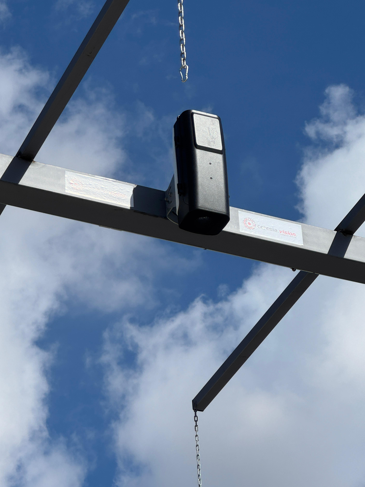

Ceres és el nostre sistema d'anàlisi per visió artificial que aporta objectivitat i precisió a la classificació dels teus fruits.

Mitjançant càmeres d'alta resolució, captura imatges a les teves tolves o cintes de selecció i les analitza a l'instant amb **Intel·ligència Artificial**. El nostre model, entrenat exhaustivament, classifica cada fruit per determinar-ne l'estat sanitari i maduració. En segons, obtens un informe detallat per prendre decisions basades en dades.

El sistema és **totalment modular**: comença amb l'essencial i amplia segons les teves necessitats.

# Base Central de Processament

És el nucli de Ceres. Es tracta d'un potent ordinador industrial que executa els nostres algorismes d'Intel·ligència Artificial amb la màxima velocitat per garantir resultats ràpids i fiables.

Des de la seva intuïtiva pantalla de control, els teus operaris poden gestionar tot el sistema, iniciar anàlisis i consultar informes detallats sense complicacions. És el centre de comandament unificat per al control de qualitat.

# Càmeres Standard

Les nostres **Càmeres Standard** són la solució ideal per a punts d'anàlisi fixos, com la tolva de recepció principal.

S'instal·len en un lloc estratègic i s'operen directament des de la pantalla de la Base Central. Amb un simple clic, l'operari captura la imatge i obté l'anàlisi de qualitat a l'instant. Són càmeres robustes, dissenyades per a l'entorn industrial i optimitzades per garantir la màxima precisió.

# Càmeres Interactives

Les **Càmeres Interactives** aporten la màxima flexibilitat a la teva operació. Dissenyades per a punts d'anàlisi múltiples o allunyats de l'oficina, permeten als operaris controlar el sistema des d'una tauleta o un mòbil.

Directament des de la zona de treball, un operari pot visualitzar la càmera, capturar la imatge i rebre l'anàlisi al seu propi dispositiu. Aquesta autonomia agilitza la feina i permet realitzar controls de qualitat a qualsevol punt de les teves instal·lacions amb total eficiència.
