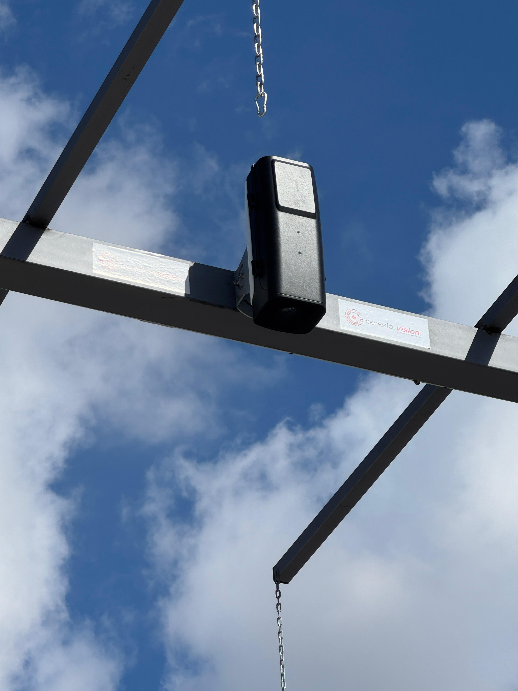

Ceres es nuestro sistema de análisis por visión artificial que aporta objetividad y precisión a la clasificación de sus frutos.

Mediante cámaras de alta resolución, captura imágenes en sus tolvas o cintas de selección y las analiza al instante con **Inteligencia Artificial**. Nuestro modelo, entrenado exhaustivamente, clasifica cada fruto para determinar su estado sanitario y maduración. En segundos, obtiene un informe detallado para tomar decisiones basadas en datos.

El sistema es **totalmente modular**: comience con lo esencial y amplíe según sus necesidades.

# Base Central de Procesamiento

Es el núcleo de Ceres. Se trata de un potente ordenador industrial que ejecuta nuestros algoritmos de Inteligencia Artificial con la máxima velocidad para garantizar resultados rápidos y fiables.

Desde su intuitiva pantalla de control, sus operarios pueden gestionar todo el sistema, iniciar análisis y consultar informes detallados sin complicaciones. Es el centro de mando unificado para el control de calidad.

# Cámaras Standard

Nuestras **Cámaras Standard** son la solución ideal para puntos de análisis fijos, como la tolva de recepción principal.

Se instalan en un lugar estratégico y se operan directamente desde la pantalla de la Base Central. Con un simple clic, el operario captura la imagen y obtiene el análisis de calidad al instante. Son cámaras robustas, diseñadas para el entorno industrial y optimizadas para garantizar la máxima precisión.

# Cámaras Interactivas

Las **Cámaras Interactivas** aportan máxima flexibilidad a su operación. Diseñadas para puntos de análisis múltiples o alejados de la oficina, permiten a los operarios controlar el sistema desde una tablet o un móvil.

Directamente desde la zona de trabajo, un operario puede visualizar la cámara, capturar la imagen y recibir el análisis en su propio dispositivo. Esta autonomía agiliza el trabajo y permite realizar controles de calidad en cualquier punto de sus instalaciones con total eficiencia.